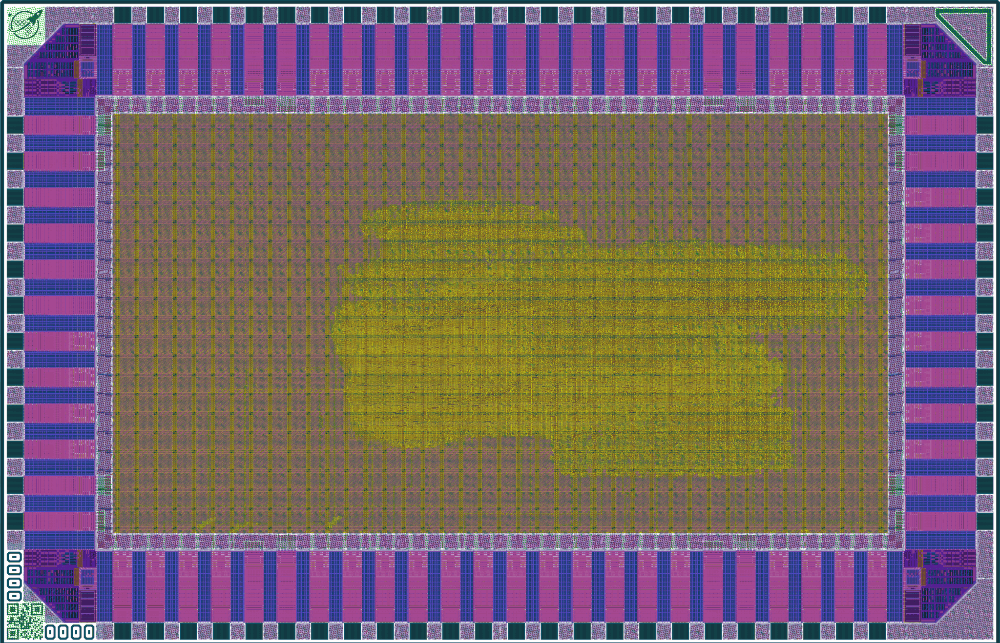
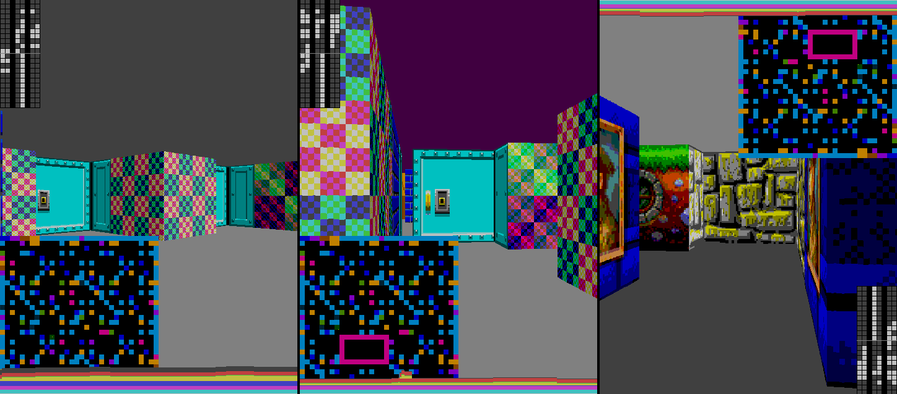

# gf180mcu raybox-zero on wafer.space run 2

## Overview

This is a full-chip implementation of [raybox-zero] on a half-height [wafer.space](https://wafer.space) die slot (`1x0p5`), for possible submission and fabrication on wafer.space run 2.



Raybox-zero races the beam of a VGA display to render a 3D world using "ray casting", which is an old 2D technique that fakes the appearance of a grid-based 3D map.



The features of this version are:
*   Fixed 32x32 map
*   SPI interface to write registers that control player viewpoint and other visual appearance parameters.
*   4 doors that can be positioned in any cells of the map and set to any open state.
*   8 built-in wall textures plus door/doorframe texture.
*   Optional QSPI interface for external texture ROM.
*   RGB222 digital VGA output (6-bit colour compatible with the Tiny VGA PMOD, and others).
*   Debug overlay option.
*   Q11.11 fixed-point precision internally.
*   Demo mode.

## Background

This project was created using the [gf180mcu Project Template](https://github.com/wafer-space/gf180mcu-project-template) and hardened using LibreLane 3 with the open-source gf180mcuD PDK (which includes digital standard cells).

The original Verilog for [raybox-zero] was tested on an FPGA and then adapted for hardening across several open PDKs (sky130, IHP's sg13cmos5l, and gf180mcuD). That repo is included as a submodule in `src/raybox-zero/` so if you clone this repo be sure to do `git clone --recurse-submodules https://github.com/algofoogle/gf180ws2-raybox-zero`

Note that [librelane/config.yaml](./librelane/config.yaml) lists the source Verilog files used to perform synthesis, including [src/src/rbz_options.v](./src/rbz_options.v) which has configuration parameters for this specific build (i.e. which options are turned on, targeting this chip).


## Hacks

### Timing hack

There are long combinatorial paths in this design (for fast computation of a reciprocal approximation using chained multipliers). For successful hardening, a timing exception was required in [the SDC file](./librelane/chip_top.sdc) that looks like this:

```sdc
set rcp_operand_nets [get_nets -hierarchical {i_chip_core.rbzero.wall_tracer.rcp_fsm.operand*}]
puts "Found [llength $rcp_operand_nets] reciprocal operand nets"
set rcp_op_net_count [llength $rcp_operand_nets]
if {$rcp_op_net_count == 0} {
    error "Could not find reciprocal operand nets"
}
if {$rcp_op_net_count != 22} {
    puts "WARNING: Expected 22 rcp_fsm operand nets, but found $rcp_op_net_count"
}
set_false_path -through $rcp_operand_nets
```

This is not an ideal exception; really it's actually a multi-cycle path because we count through "wait states" while the logic is given (ample) time to settle. By making it a false path, there's a risk that other surrounding logic might not get valid timing, but I ran out of time trying to work out the correct way to specify the multi-cycle path particularly when yosys/ABC logic reduction was in play.


### GL simulation hack

Doing gate-level simulation using Icarus Verilog (iverilog) didn't work as expected on the first (successful) hardening attempt as it appeared synchronous register resets were falling to `X` states. LLM assistance (by analysis of the RTL and PNL Verilog) suggests the DFFs used are non-async-reset types and instead achieve a silicon-valid reset through a pattern of `D = ~(~q | q) = 0` but which [does not work correctly in a four-state simulation](https://discord.com/channels/1009193568256135208/1009193776155205696/1526704559156891809).

I changed `SYNTH_STRATEGY` to `"DELAY 2"` which implements the logic differently, thus I didn't notice any more unexpected `X` states in my simulation.


## Dependencies

To manage all build/tool dependencies, the project template includes a Nix shell with all the required tools.
Install Nix and LibreLane by following the Nix-based installation instructions: https://librelane.readthedocs.io/en/latest/installation/nix_installation/index.html

To activate the shell, simply run `nix-shell` in the root directory of this repository. The subsequent steps assume that you are in the Nix shell of the project template.

## Prerequisites

The project template uses the open_pdks gf180mcuD variant of the PDK.
To clone the latest PDK version via [Ciel](https://github.com/fossi-foundation/ciel), run `make clone-pdk`.

## Implement the Design

With the Nix shell enabled, run the implementation:

```
SLOT=1x0p5 make librelane
```

You can find all output artifacts in the `librelane/runs/<timestamp>/` directory.

## View the Design

After completion, you can view the design using the OpenROAD GUI:

```
make librelane-openroad
```

Or using KLayout:

```
make librelane-klayout
```

## Verification and Simulation

Verification of the chip is done with [cocotb](https://www.cocotb.org/). Cocotb is a Python-based testbench environment. The simulator that is used by the project template is [Icarus Verilog](https://github.com/steveicarus/iverilog).

The testbench is located in `cocotb/chip_top_tb.py`, and it is accompanied by a wrapper testbench called [chip_top_wrapper.v](./cocotb/chip_top_wrapper.v) that breaks out signals for more convenient access -- this enables us to test chip-level (at the pads) but with proper signal names.

To run the RTL simulation:

```
SLOT=1x0p5 make sim
```

To run the GL (gate-level) simulation, run the following command:

```
SLOT=1x0p5 make sim-gl
```

> [!NOTE]
> You need to have the latest implementation of your design in the `final/` folder. After a run has completed without errors, the final views will be copied to `final/`.
>
> For your convenience, I've also included a copy of the "PNL" (Powered gate-level Net List) in [wafer.space/](./wafer.space/).

In both cases, a waveform file will be generated under `cocotb/sim_build/chip_top.fst`.
You can view it using a waveform viewer, for example, [GTKWave](https://gtkwave.github.io/gtkwave/).

```
make sim-view
```

You can now update the testbench according to your design.

## Implementing Your Own Design

See the [Implementing Your Own Design](https://github.com/wafer-space/gf180mcu-project-template#implementing-your-own-design) heading of the wafer.space template.


## Precheck

To check whether this (or any) design is suitable for manufacturing, run the [gf180mcu-precheck](https://github.com/wafer-space/gf180mcu-precheck) with your layout.

[raybox-zero]: https://github.com/algofoogle/raybox-zero
